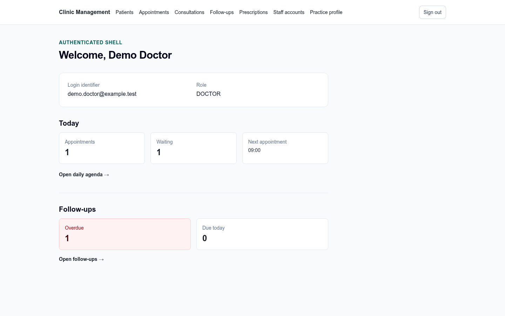
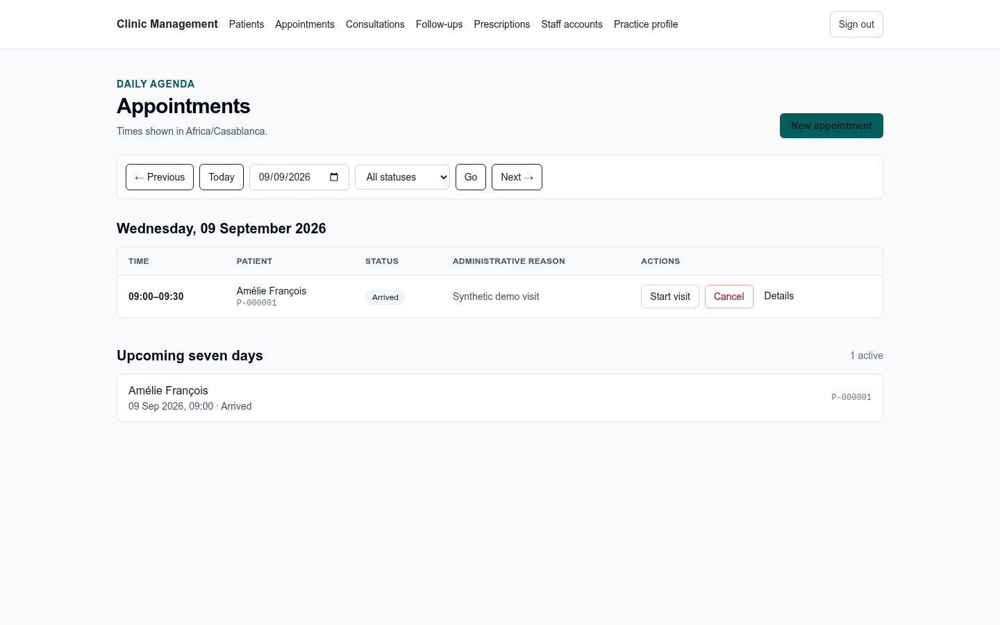
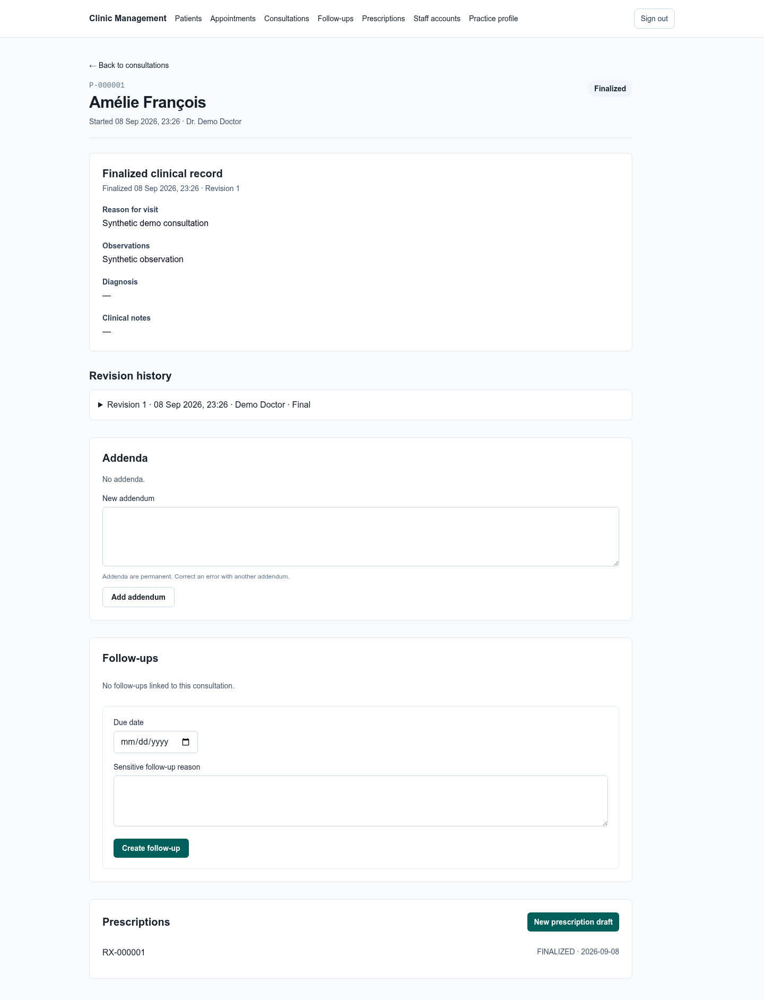
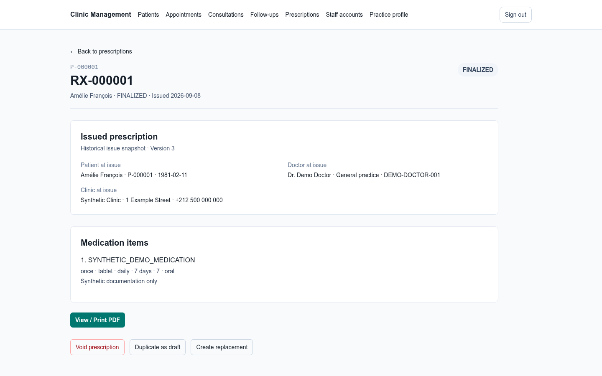
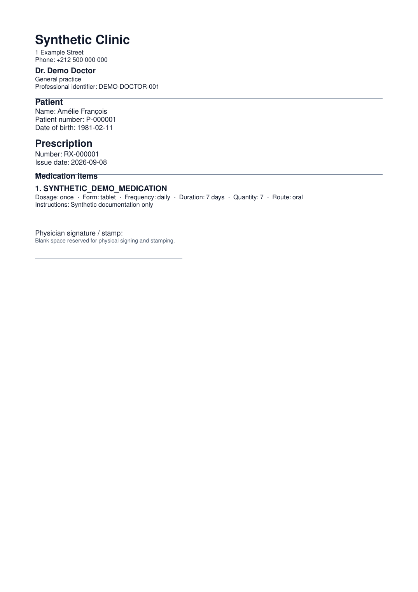

# Clinic Management

Clinic Management is an open-source practice management application for small medical clinics and cabinets. It covers administrative patient records, appointments, doctor-only consultations and clinical note history, follow-ups, prescriptions, printable prescription PDFs, and separate doctor/secretary authorization.

## Development status

**Beta 0.1.0-beta.1:** the first feature set is frozen and release hardening is in progress. Authenticated staff can manage administrative patient records and appointments. Doctors additionally manage consultation records, follow-ups, physician-entered prescriptions with immutable issued history, and regenerate A4 PDFs from finalized issue snapshots. This is an open-source beta, not production-ready healthcare software.

> **Synthetic data only:** this repository, its fixtures, and any public demonstration must never contain real patient data or identifiable information copied from real people.

This project is not production-ready healthcare software. A real deployment requires an independent security review and all applicable legal and compliance reviews. The project does not claim automatic compliance with Moroccan Law 09-08, CNDP requirements, HIPAA, GDPR, or any other framework.

## Screenshots

All screenshots use synthetic demo data. The complete set is in [`docs/assets/screenshots/`](docs/assets/screenshots/).







## Technology

- Next.js App Router and React
- Strict TypeScript
- PostgreSQL 18 for local development
- Drizzle ORM and migration tooling
- Zod environment validation
- Tailwind CSS
- Vitest
- pnpm
- Better Auth database sessions with explicit Argon2id password hashing
- PDFKit for server-generated A4 prescription documents
- Docker Compose for local PostgreSQL

## Engineering highlights

- Server-side capability authorization and database-backed sessions.
- Immutable clinical note revisions and finalized prescription history with issue snapshots.
- Optimistic concurrency for edits and lifecycle transitions, including transactional prescription numbering.
- Append-only audit events with sensitive clinical values excluded from metadata and logs.
- Private, no-store responses for clinical and prescription content.
- Synthetic demo mode and a hard guard around destructive integration-test database operations.

## Requirements

- Node.js 24 or newer
- pnpm 11 or newer
- Docker with Docker Compose

## Setup

```bash
pnpm install
cp .env.example .env
# Replace BETTER_AUTH_SECRET with: openssl rand -base64 32
docker compose up -d
pnpm db:migrate
pnpm auth:create-doctor
pnpm dev
```

Open <http://localhost:3000>. The checked-in environment values are local demonstration placeholders, not production credentials.

Health endpoints:

- `GET /api/health/live` confirms that the application process can respond.
- `GET /api/health/ready` confirms that the application can reach PostgreSQL.

Readiness intentionally depends on PostgreSQL; liveness does not. Orchestrators should restart a dead process but should remove an application with a temporarily unavailable database from service without creating a restart loop.

Stop the database with `docker compose down`. Add `--volumes` only when intentionally discarding all local development data.

## Environment configuration

| Variable                   | Purpose                                                       |
| -------------------------- | ------------------------------------------------------------- |
| `NODE_ENV`                 | `development`, `test`, or `production`                        |
| `APP_URL`                  | Exact canonical origin used for cookies and origin checks     |
| `DATABASE_URL`             | PostgreSQL connection URL used by the application and Drizzle |
| `BETTER_AUTH_SECRET`       | Random application secret; generate separately per deployment |
| `AUTH_ARGON2_MEMORY_KIB`   | Argon2id memory cost; defaults to 65,536 KiB                  |
| `AUTH_ARGON2_TIME_COST`    | Argon2id iteration cost; defaults to 3                        |
| `AUTH_ARGON2_PARALLELISM`  | Argon2id parallelism; defaults to 1                           |
| `AUTH_TRUSTED_PROXY_CIDRS` | Optional comma-separated trusted proxy CIDRs                  |
| `CLINIC_TIMEZONE`          | IANA timezone used for appointment entry and daily agendas    |
| `POSTGRES_DB`              | Local Compose database name                                   |
| `POSTGRES_USER`            | Local Compose database user                                   |
| `POSTGRES_PASSWORD`        | Local Compose database password                               |

Application environment variables are validated at server startup. Server configuration is kept outside the `NEXT_PUBLIC_` namespace so it cannot be intentionally bundled for browser use.

## Commands

```bash
pnpm dev             # development server
pnpm build           # production build
pnpm start           # run the production build
pnpm lint            # ESLint
pnpm typecheck       # strict TypeScript check
pnpm test            # test suite once
ALLOW_TEST_DATABASE_RESET=true DATABASE_URL=postgresql://.../clinic_integration_test pnpm test:integration
                     # PostgreSQL-backed destructive integration tests; dedicated _test DB only
pnpm test:watch      # test suite in watch mode
pnpm format          # format files
pnpm format:check    # verify formatting
pnpm db:generate     # generate a reviewed migration from schema changes
pnpm db:migrate      # apply checked-in migrations
pnpm db:check        # validate migration history
pnpm db:studio       # local Drizzle Studio
pnpm auth:create-doctor # interactively bootstrap the one doctor
pnpm auth:reset-doctor-password # operator recovery for the doctor account
pnpm test:e2e                 # production-mode Playwright workflow (isolated _test DB)
pnpm db:seed:demo             # explicit synthetic demo seed (requires ALLOW_DEMO_SEED=true)
pnpm db:backup /secure/clinic.dump
pnpm db:restore /secure/clinic.dump
```

Do not use runtime schema synchronization in production. Every schema change must be represented by a reviewed migration.

Integration tests reset their database between cases. The reset is guarded in code and runs only
when `NODE_ENV=test`, `ALLOW_TEST_DATABASE_RESET=true`, and the parsed PostgreSQL database name ends
in `_test` without production-like naming. Use a dedicated disposable database; the guard rejects
the normal `clinic_demo` development database before issuing `TRUNCATE`.

For browser tests, copy `.env.test.example` to a separate environment and use an isolated database.
E2E preparation applies the same hard guard. It never overwrites `.env` or permits demo, staging, or
production-looking database names. Demo credentials are synthetic and explicitly development-only.

## Authentication and account recovery

There is no public registration, public password reset, email verification, or social login. Bootstrap the single doctor with `pnpm auth:create-doctor`; password entry is hidden on an interactive terminal. The doctor creates, disables, re-enables, and resets secretary credentials at `/settings/users`. Operator recovery for the doctor uses `pnpm auth:reset-doctor-password`. Passwords are set directly and are never emailed or displayed after submission.

The configured `APP_URL` must match the browser-facing origin. Production ingress must terminate HTTPS, prevent direct origin access, and replace—not append untrusted values to—the forwarded client-IP header. See the security architecture for session, CSRF, proxy, and throttle details.

## Patient administration

`/patients` provides bounded search and pagination for patient number, name, phone, and email. Searches use an authenticated request body so patient identifiers do not appear in URL access logs. Patient records contain administrative contact information only—there are no medical-history, diagnosis, note, medication, or other clinical fields. Patient numbers are immutable and allocated by PostgreSQL. Concurrent edits use a version token and return a conflict instead of silently overwriting newer changes.

Both roles can create and edit active records. Only the doctor can archive or restore a patient. Archiving preserves the UUID and patient number, hides the record from default searches, and prevents ordinary editing until restoration.

## Appointment scheduling

`/appointments` provides a clinic-timezone daily agenda, date navigation, and a bounded seven-day upcoming list. Staff create appointments through an active-patient search, reschedule only while scheduled, and use explicit lifecycle operations. The doctor starts a consultation from an arrived appointment. Consultation creation and the appointment transition to `IN_CONSULTATION` are atomic. Once linked, consultation finalization is the only path to `COMPLETED`, and both records change in one transaction.

Times are entered in `CLINIC_TIMEZONE` and stored as PostgreSQL `timestamptz` instants. Overlaps use half-open intervals and return a server-calculated warning; an authorized user must explicitly confirm before the server rechecks and accepts the double-booking. Appointments are never deleted. Every appointment must be terminal before its patient can be archived, including operationally stale appointments whose planned end has passed.

## Consultations and clinical notes

Doctors can start a direct consultation for an active patient or start one from an arrived appointment. Consultation content is plain text and stored as complete, immutable revisions. Explicit finalization freezes the latest revision; later corrections are append-only addenda. A patient with an in-progress consultation cannot be archived.

Clinical routes are doctor-only, use explicit clinical DTOs, and return private, no-store responses. Clinical values are excluded from application logs and audit metadata. Infrastructure-level encryption for storage and backups is required for a responsible production deployment; application field encryption is deliberately deferred until an external key-management design exists.

## Follow-up management

Doctors can create follow-ups for active patients or from either in-progress or finalized consultations. Consultation-linked creation derives the patient on the server. Follow-ups use clinic-local calendar dates and appear in bounded overdue, due-today, and upcoming sections; application creation rejects past dates while the database permits controlled historical imports.

Pending follow-ups can be corrected with optimistic concurrency and then completed or cancelled exactly once. Terminal records cannot be edited, reopened, or deleted. A pending follow-up blocks patient archival; completed and cancelled history remains preserved without blocking archival. Follow-up reasons are doctor-only plain text, excluded from logs and audit metadata, and served with private/no-store caching. Notifications and reminders are intentionally not implemented.

## Prescription management

Doctors create and edit physician-entered draft prescriptions, then explicitly finalize them. Finalization allocates a transactional `RX-000001`-style number, stores the clinic-local issue date, and captures an immutable patient/doctor/clinic issue snapshot. Issued prescriptions are immutable; corrections use a new replacement draft, while duplication creates an independent draft with no lineage. Issued records may be voided without deletion. Prescription items are bounded plain text with deterministic positions, and the application provides no recommendations, medication database, interaction checking, or decision support.

Practice and doctor professional profiles are doctor-only and versioned. Draft prescriptions block patient archival; finalized and void prescriptions do not. Prescription APIs and pages are private/no-store, and medication content is excluded from logs, audit metadata, URLs, browser storage, and secretary DTOs. Finalized and void prescriptions can be regenerated as in-memory A4 PDFs from immutable snapshot/item data; PDFs are never stored. The browser's native PDF viewer handles printing, and the app audits generation rather than claiming physical printer completion.

## Project structure

```text
src/app/            Next.js routes and layouts
src/config/         validated server configuration
src/db/             database client and schema entrypoint
src/modules/auth/   authentication, sessions, throttling, capabilities
src/modules/users/  staff-account validation and services
src/modules/patients/ administrative patient validation, DTOs, queries, services
src/modules/appointments/ scheduling, timezone, lifecycle, DTOs, queries, services
src/modules/consultations/ doctor-only clinical DTOs, validation, queries, services
src/modules/follow-ups/ doctor-only follow-up lifecycle, DTOs, queries, services
src/modules/prescriptions/ doctor-only drafts, immutable history, profiles, DTOs, queries, services
src/lib/            narrowly scoped shared infrastructure
docs/architecture/  system, security, and data-model documentation
docs/adr/           architectural decision records
drizzle/            generated and reviewed database migrations
tests/              future integration and end-to-end test support
```

Medication intelligence, notification, attachment, billing, signature/stamp images, and PDF-byte archival modules do not exist. Arabic/RTL rendering and jurisdiction-specific legal formatting remain deferred.

## Documentation

- [Architecture overview](docs/architecture/overview.md)
- [Security architecture](docs/architecture/security.md)
- [Planned data model](docs/architecture/data-model.md)
- [Backup and restore strategy](docs/architecture/backup-restore.md)
- [Architectural decisions](docs/adr/README.md)
- [Contributing](CONTRIBUTING.md)
- [Security policy](SECURITY.md)
- [Beta release notes](docs/releases/0.1.0-beta.md)

## Production warning

The Compose configuration and example credentials are for local development only. A responsible production design requires HTTPS, private database networking, independently managed secrets, least-privilege database roles, encrypted and restore-tested backups, monitoring, incident response, and a deployment-specific security and legal review. Retention and disaster-recovery objectives are operator decisions and are not automated in V1.

Known beta limitations include one clinic/doctor instance, English UI, no Arabic/RTL PDF, no notifications,
patient portal, billing, medication intelligence, digital signatures, or stored PDF bytes. Exact legal
prescription formatting remains a deployment/jurisdiction responsibility.

## License

Licensed under the [Apache License 2.0](LICENSE).
